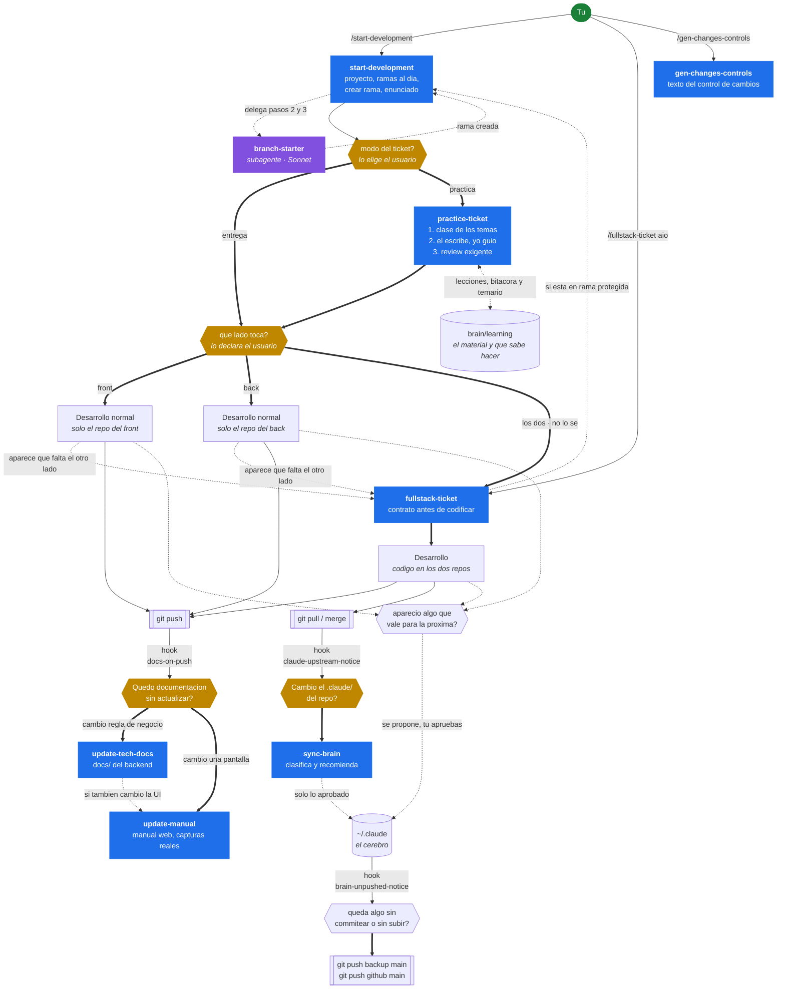

# Flujo del cerebro — mapa mental

> Complementa el [README](README.md). Aqui esta **como se encadenan** las piezas; alla, que es
> cada una.

## La respuesta corta

**Las skills no se llaman solas.** `start-development` no dispara a las demas. Lo que existe es:

| Mecanismo | Quien decide | Ejemplo |
|---|---|---|
| **Automatico** | El programa | Un hook salta con `git pull` o `git push`, sin que nadie lo pida |
| **Encadenado** | Claude, leyendo el `SKILL.md` | `start-development` termina y dice "sigue con `fullstack-ticket`" |
| **Delegado** | Claude, dentro de una skill | Los pasos mecanicos se van a un subagente en Sonnet |
| **Manual** | Tu | `/gen-changes-controls` solo corre si lo pides |

Un encadenamiento **no es automatico**: se propone y tu puedes decir que no. La unica pieza que
actua sin preguntar es el hook, y ninguno de los tres escribe nada: solo avisan.

---

## Mapa



**Leyenda de las flechas**

- `===>` encadenado: se propone y puedes decir que no.
- `- - >` delegado o de vuelta.
- `--->` disparo automatico del hook.

> El diagrama es Mermaid. GitLab lo renderiza solo; **la vista previa de VS Code no**, hace falta
> la extension *Markdown Preview Mermaid Support*. Debajo esta el mismo mapa en texto plano, que
> se ve en cualquier sitio.

---

## El mismo mapa, sin extensiones

```
  TU
   │
   ├── /start-development ─────────────────────────────────┐
   │        1. que proyecto            (pregunta)          │
   │        2. ramas al dia      ─┐                        │
   │        3. crear rama         ├─► branch-starter       │
   │                              │   (subagente, Sonnet)  │
   │        4. enunciado + QUE LADO TOCA + QUE MODO        │
   │              │                                        │
   │      modo practica ──► /practice-ticket               │
   │        1. CLASE de los temas del ticket               │
   │           (material en learning/lessons/)             │
   │        2. tu escribes, yo guio con pistas             │
   │        3. review exigente, tu corriges                │
   │        4. bitacora y temario en learning/             │
   │              │                                        │
   │      front ──┼── back ── los dos / no lo se            │
   │        │     │     │           │                       │
   │        ▼     │     ▼           │                       │
   │   desarrollo solo un repo      │                       │
   │        │                       │                       │
   │        └── aparece que falta ──┤                       │
   │            el otro lado        │                       │
   │                              │                        │
   │                              ▼                        │
   ├── /fullstack-ticket aio ◄────┘                        │
   │        0. situarse ── en rama protegida? ─► vuelve a start-development
   │        1. encuadrar                                   │
   │        2. reconocer                                   │
   │        3. FIJAR EL CONTRATO   ◄── punto de control    │
   │        4. ejecutar los dos lados                      │
   │        5. verificacion cruzada                        │
   │        6. cierre                                      │
   │                              │                        │
   │                              ▼                        │
   │                        DESARROLLO                     │
   │                         /        \                    │
   │                 git push          git pull            │
   │                    │                  │               │
   │       [hook docs-on-push]   [hook claude-upstream]    │
   │                    │                  │               │
   │        ┌───────────┴──────┐           ▼               │
   │        ▼                  ▼      /sync-brain          │
   │  /update-tech-docs  /update-manual    │               │
   │   docs/ del back     manual web       ▼               │
   │                                  absorbe al cerebro   │
   │                                                       │
   └── /gen-changes-controls  (suelta, cuando la pidas) ───┘
```

---

## Que pasa exactamente al escribir `/start-development`

1. **Lee lo que ya dijiste.** Si escribiste `/start-development aio feature desa 10842 Descripcion`,
   reconoce los cinco datos en cualquier orden y no pregunta nada.
2. **Pregunta lo que falte.** Proyecto siempre primero, y **nunca deducido** del directorio.
3. **Delega a `branch-starter`** (Sonnet) actualizar ramas y crear la rama, si no falta ningun dato.
4. **Te pide el contexto**: enunciado, recurso nuevo o ajuste, modulo de referencia.
5. **Se detiene y enruta segun el lado que declaraste:** los dos o "no lo se" -> propone
   `fullstack-ticket`; un solo lado -> desarrollo normal en ese repo. **Propone; no arranca solo.**
6. **Y segun el modo:** en `practica`, encadena `practice-ticket`, que conduce el desarrollo
   entero —clase primero, luego tu tecleas y yo guio y reviso—. En `entrega`, todo sigue como
   siempre.

Lo que **no** hace: no commitea, no empuja, no resuelve divergencias, no borra ramas.

---

## Cuando interviene cada skill

| Momento | Skill | Como llega |
|---|---|---|
| Antes de escribir codigo | `start-development` | La pides tu |
| El ticket se hace como ejercicio (clase + desarrollo tuyo) | `practice-ticket` | Encadenada si elegiste modo practica |
| El ticket cruza front y back | `fullstack-ticket` | Encadenada, o la pides |
| A mitad del desarrollo aparece el otro lado | `fullstack-ticket` | Reclasificacion: se avisa, se crea la rama que falta y se entra por la Fase 3 |
| Cambio una regla de negocio del back | `update-tech-docs` | Hook del push, o la pides |
| Cambio algo que el usuario ve | `update-manual` | Hook del push, o al cerrar `fullstack-ticket` |
| Un pull trajo cambios en `.claude/` | `sync-brain` | Hook del pull |
| Hay que entregar el control de cambios | `gen-changes-controls` | Solo manual |

---

## Lo que ningun automatismo hace por ti

- **Redactar la documentacion.** Los hooks avisan; escribir exige entender *por que* cambio algo,
  y eso muchas veces solo lo sabes tu.
- **Generar el manual en un push.** Necesita Chrome, dev server, backend con datos y **revisar las
  capturas**. Tarda de 2 a 4 minutos y una corrida puede salir con el mapa a medio dimensionar.
- **Absorber cambios del equipo.** `sync-brain` clasifica y recomienda; aprobar es tuyo.
- **Commitear.** Ninguna skill commitea en un repo de trabajo sin que lo pidas.
- **Aprender por ti.** En modo practica hay clase antes del codigo, pero el codigo lo escribes tu:
  la skill da pistas graduadas y revisa, y no teclea. Salirse del modo lo decides tu, en cualquier
  momento.
