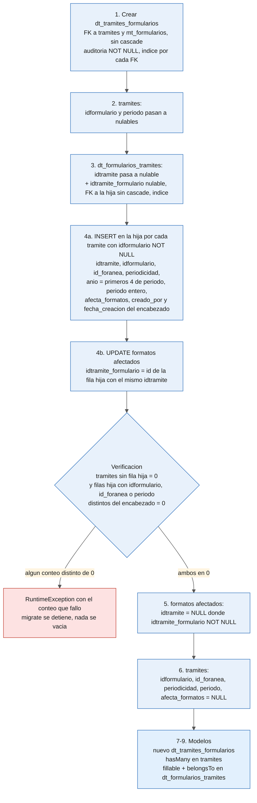
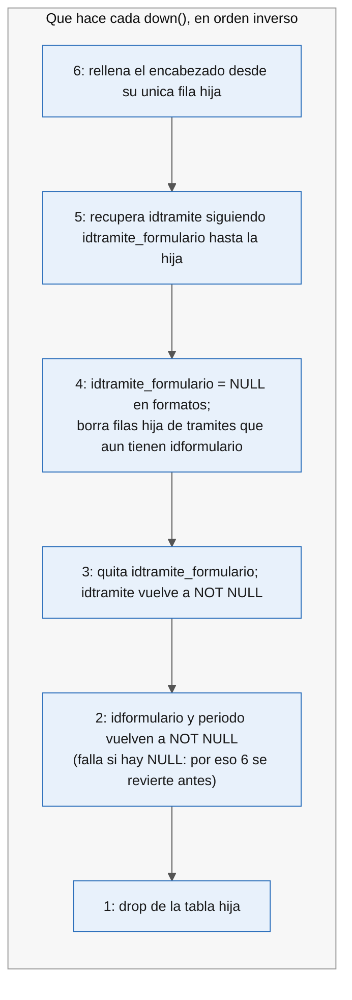

# 10841 — Etapa A: base de datos y modelos · status · 2026-09-04

Rama `feature/10841-fabian-originDesa-AjusteGestorTramites`. Plan corregido a partir del borrador
de Fabian. Lo que cambio respecto al borrador: nombres con formato de Laravel, la migracion 3
agrega la columna nueva ademas de volver nulable la vieja, el down de la copia sabe que borrar,
los dos vaciados tienen down que restaura y autoverificacion, y entran los tres modelos.

## Diagrama





## Datos que decidieron el plan (base local, solo lectura)

| Dato | Valor | Consecuencia |
|---|---|---|
| Tramites | 140 | |
| Tramites sin `creado_por` | 0 | Auditoria de la hija puede ser NOT NULL, copiando el creador del encabezado |
| Filas en formatos afectados | 15 | El paso 4b si encuentra datos que enlazar (la HU decia 0 en prod) |
| Formato real de `periodo` | `YYYYMMDD` | La HU decia `YYYYMM`. Se copia entero; `anio` son los 4 primeros |

## Plan de construccion

Todos los comandos corren en el contenedor. Nunca `--pretend`: aqui ejecuta de verdad.

### Paso 1. Crear la tabla hija

```bash
docker exec status php artisan make:migration create_dt_tramites_formularios_table
```

`make:migration` crea en `database/migrations/` un archivo con fecha y hora y una clase vacia con
`up()` y `down()`. Dentro, `Schema::connection('SmGestorTrans')->create(...)`: `id`, `idtramite`
FK a `gestor_transaccional.tramites`, `idformulario` FK a `gestor_maestros.mt_formularios`,
`id_foranea` entero nulable sin FK, `periodicidad` (20), `anio` (4), `periodo` (20),
`afecta_formatos` booleano nulable, auditoria como en `dt_formularios_tramites`, indice por cada
FK, `->comment()` en espanol en cada columna. Sin cascade. `down()`: `dropIfExists` de esta tabla.

```bash
docker exec status php artisan migrate
docker exec status php artisan tinker --execute="var_dump(Schema::connection('SmGestorTrans')->hasTable('dt_tramites_formularios'));"
docker exec status php artisan migrate:rollback --step=1
docker exec status php artisan migrate
```

### Paso 2. Nulables en el encabezado

```bash
docker exec status php artisan make:migration hacer_nulables_campos_formulario_en_tramites_table
```

`->table('tramites', ...)` y por columna `->nullable()->change()`, repitiendo el tipo exacto
actual (`idformulario` unsignedBigInteger, `periodo` string(10)). `change()` funciona porque
`doctrine/dbal` esta instalado. `down()`: lo mismo sin `nullable()`.

```bash
docker exec status php artisan tinker --execute="print_r(DB::connection('SmGestorTrans')->select(\"select column_name, is_nullable from information_schema.columns where table_schema='gestor_transaccional' and table_name='tramites' and column_name in ('idformulario','periodo')\"));"
```

### Paso 3. Formatos afectados apuntan al formulario

```bash
docker exec status php artisan make:migration agregar_idtramite_formulario_a_dt_formularios_tramites_table
```

`idtramite` a nulable con `change()`; agregar `idtramite_formulario` bigint nulable, FK a
`gestor_transaccional.dt_tramites_formularios` sin cascade, indice. `down()`: quita FK, indice y
columna; `idtramite` vuelve a NOT NULL. Misma verificacion del paso 2 con esta tabla.

### Paso 4. Copia

```bash
docker exec status php artisan make:migration copiar_formularios_de_tramites_a_dt_tramites_formularios
```

Sin Blueprint: `DB::connection(...)->statement()` con SQL, como
`2026_08_13_090000_cambiar_tipo_campo_tramite_a_tramites_tabla.php`. `INSERT INTO ... SELECT`
desde `tramites` con `idformulario IS NOT NULL`, `anio = substring(periodo from 1 for 4)`,
`periodo` completo. Luego `UPDATE` de formatos afectados con el id de la fila hija del mismo
`idtramite`. `down()`: primero `idtramite_formulario = NULL`, despues borra las filas hija cuyo
tramite todavia tiene `idformulario`.

Verificacion, ambos conteos deben dar 0:

```bash
docker exec status php artisan tinker --execute="echo DB::connection('SmGestorTrans')->select('select count(*) as n from gestor_transaccional.tramites t where not exists (select 1 from gestor_transaccional.dt_tramites_formularios h where h.idtramite = t.id)')[0]->n, PHP_EOL; echo DB::connection('SmGestorTrans')->select('select count(*) as n from gestor_transaccional.tramites t join gestor_transaccional.dt_tramites_formularios h on h.idtramite = t.id where h.idformulario <> t.idformulario or h.periodo <> t.periodo or coalesce(h.id_foranea,0) <> coalesce(t.id_foranea,0)')[0]->n, PHP_EOL;"
```

### Pasos 5 y 6. Vaciados con autoverificacion

```bash
docker exec status php artisan make:migration vaciar_idtramite_en_dt_formularios_tramites
docker exec status php artisan make:migration vaciar_campos_formulario_en_tramites
```

Cada `up()` corre los dos conteos del paso 4; si alguno no es 0 lanza `RuntimeException`
diciendo cual fallo, y el migrate se detiene sin vaciar. Si pasan, `UPDATE ... SET ... = NULL`.
`down()`: formatos recupera `idtramite` via `idtramite_formulario`; encabezado copia de vuelta las
cinco columnas desde su unica fila hija.

Verificar: `migrate`, contar NULLs, `migrate:rollback --step=2`, contar que se restauraron,
`migrate`.

### Paso 7. Modelo nuevo

```bash
docker exec status php artisan make:model ModelGestor/dt_tramites_formularios
```

Crea la clase en `app/ModelGestor/` con namespace `App\ModelGestor`. Dentro: `$timestamps =
false`, `$connection = 'SmGestorTrans'`, `$table`, `$fillable` completo, `$casts` con
`afecta_formatos => boolean`, relaciones `belongsTo` tramite, `belongsTo` formulario maestro,
`hasMany` formatos afectados por `idtramite_formulario`. Estilo de `dt_formularios_tramites.php`.

### Paso 8. Modelo `tramites.php`

Relacion `hasMany` hacia el modelo nuevo por `idtramite`. `formulariosTramites` se queda; la
Etapa B decide.

### Paso 9. Modelo `dt_formularios_tramites.php`

`idtramite_formulario` al `$fillable` y `belongsTo` hacia la fila hija.

```bash
docker exec status php artisan tinker --execute="\$t = App\ModelGestor\tramites::with('tramitesFormularios.formatosAfectados')->first(); echo \$t->tramitesFormularios->count(), PHP_EOL;"
```

(ajustar los nombres de relacion a los elegidos)

### Paso 10. Tests

En `tests/Feature/GestorInformacion/GestionTramites/gestionTramitesTest.php:17-45` agregar
`hasTable` de la tabla nueva y `hasColumn` de `idtramite_formulario`.

```bash
docker exec status ./vendor/bin/phpunit --filter tieneTabla tests/Feature/GestorInformacion/GestionTramites/gestionTramitesTest.php
```
