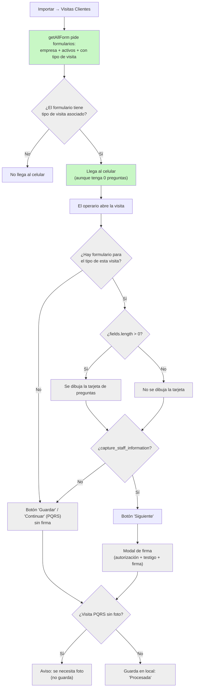

# AMI 11349 — Firma en visitas con formulario sin preguntas (Green)

Etapa única: **front** (app-movil). El backend no se toca: `has_fields` ya es opcional allá.

## Qué cambió respecto a tu borrador

- Se agregó **volver a importar** como paso obligatorio de la prueba (sin eso se ve la falla vieja).
- Se corrigió la regla: la firma depende **solo** de "Capturar datos", no de las preguntas.
- Se agregó el caso nuevo: formulario **sin** "Capturar datos" y **sin** preguntas, que antes no
  llegaba al celular y ahora sí.

## Diagrama: qué pasa al ejecutar la visita

Lo sombreado en gris **no cambia**; lo verde es lo que el ticket modifica.

Antes del cambio, `getAllForm` pedía además "con al menos una pregunta", así que un formulario con
"Capturar datos" y 0 preguntas se quedaba en X y la visita terminaba en G.

## Plan de construcción

### Paso 1 — Quitar la condición de la importación

- **Archivo**: `src/services/api/modules/respel/commercial-advisor-visits/CommercialAdvisorVisitsApi.ts`,
  función `getAllForm`.
- **Qué debe quedar**: el objeto `filter` sigue pidiendo empresa, activos y con tipo de visita.
  Solo desaparece la condición de "con campos". Nada más cambia en la función.
- **Documentación**: revisa si el docblock de la función menciona las preguntas o los campos; si
  lo hace, que deje de decirlo. Sin comentarios sueltos dentro del código.
- **Verificación**: `npm run lint` sin errores nuevos en ese archivo.

### Paso 2 — Datos de prueba para los cuatro casos

Ya existe el caso A. Los otros se crean en la base local del backend (lo hago yo si me lo pides):

| Caso | Formulario | Visita | Qué debes ver |
|---|---|---|---|
| A | Capturar datos **sí**, 0 preguntas (id 5) | 5467 normal, 5468 PQRS | "Siguiente" → modal de firma → guarda |
| B | Capturar datos **no**, 0 preguntas | por crear | "Guardar", sin tarjeta y sin firma |
| C | Capturar datos **sí**, con preguntas | por crear | Tarjeta de preguntas + "Siguiente" → firma |
| D | Sin formulario para el tipo de visita | por crear | "Guardar", como siempre |

### Paso 3 — Reimportar y probar

1. Levanta la app: `npm run dev -- --port 5180 --strictPort`.
2. Si hay visitas pendientes, **envíalas** (Enviar → Visitas Comerciales).
3. **Importar → Visitas Clientes.** En F12 → Network, la respuesta de `custom-get-all` ahora debe
   traer el formulario 5 (y el del caso B).
4. Abre cada visita de la tabla del paso 2 y compara con la columna "Qué debes ver".
5. En la visita PQRS (5468), toma la foto **antes** de dar "Siguiente": la validación de foto va
   después de la firma.

### Paso 4 — Enviar y confirmar en el servidor

- Enviar → Visitas Comerciales. La visita 5467 debe quedar `Procesada` en `client_visits`, con un
  adjunto `signature = true` en `client_visit_attachments`. Consulta de solo lectura.
