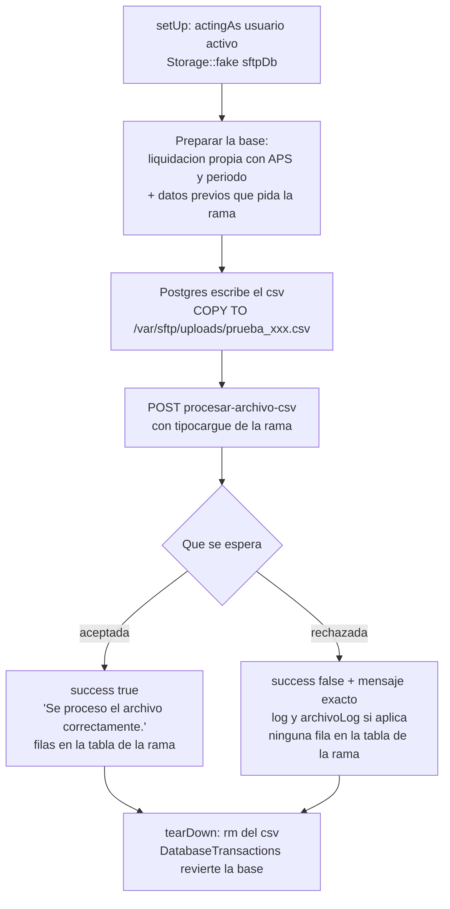

# Ticket 11180 — Etapa 1: pruebas que fijan el comportamiento actual de `procesar`

Repo: `status-full/status-api`, rama `feature/11180-fabian-originDesa-AjusteCalculoPromedioToneladas`.
Pruebas escritas por Claude a pedido de Fabian (peldano 4 en esta parte).

## El problema del archivo

`crearTablaTmp` y `cargaTablaBase` leen el csv con `COPY ... FROM '/var/sftp/uploads/<archivo>'`:
lo lee **Postgres**, desde su propio disco (volumen del contenedor `postgres_postgis_17`). Un
`Storage::fake` deja el archivo en el disco de PHP, donde Postgres no mira.

Solucion de la prueba: el archivo lo escribe el propio Postgres con
`COPY (SELECT ...) TO '/var/sftp/uploads/<nombre unico>.csv'`, y se borra en `tearDown` con
`COPY (SELECT 1) TO PROGRAM 'rm -f ...'`. Ademas `Storage::fake('sftpDb')`, para que
`eliminaArchivo` y el log no toquen el SFTP real (172.17.10.14, fuera de local).

## Flujo de cada prueba

## Casos

| # | Rama | Caso | Base antes | Archivo | Respuesta | Base despues |
|---|---|---|---|---|---|---|
| 1 | Tronco | Estructura invalida | Liquidacion | Columnas que no cuadran con `dt_estructura` | Rechazo "La estructura del archivo no cumple…", `log` true | Sin filas en `dt_cargue_toneladas` |
| 2 | Toneladas | Carga valida | Liquidacion | Filas del municipio de la APS, mes anterior al periodo | "Se proceso el archivo correctamente." | Filas en `dt_cargue_toneladas` |
| 3 | Toneladas | Sin mes anterior (caso Melgar) | Liquidacion | Filas del municipio, solo del semestre anterior | Rechazo "…no cuenta con toneladas cargadas al mes anterior…" | Sin filas |
| 4 | Recaudo | Carga valida | Liquidacion con toneladas cargadas de los periodos del archivo | Periodos <= periodo, sin campos vacios | Aceptada | Filas en `dt_cargue_recaudo` |
| 5 | Recaudo | Sin toneladas | Liquidacion sin `dt_cargue_toneladas` | Recaudo valido | Rechazo "No hay toneladas cargadas para el periodo…" | Sin filas en `dt_cargue_recaudo` |
| 6 | Reliquidacion | Carga valida | Datos de reliquidacion con toneladas a reliquidar | Filas de esos periodos | Aceptada | Filas en `reli_dt_cargue_recaudo` |
| 7 | Reliquidacion | Sin toneladas a reliquidar | Sin datos de reliquidacion | Filas validas | Rechazo "Hay filas sin toneladas a reliquidar…", con log | Sin filas |

## Archivo

`tests/Feature/Modules/Aprovechamiento/CargarArchivos/ProcesarArchivoCsvTest.php`: un solo
archivo, con los helpers privados para escribir el csv y crear la liquidacion.

## Verificacion

`./vendor/bin/sail test --filter=ProcesarArchivoCsvTest` en verde contra el codigo actual,
**sin tocar el controlador**. Despues, la suite completa.
