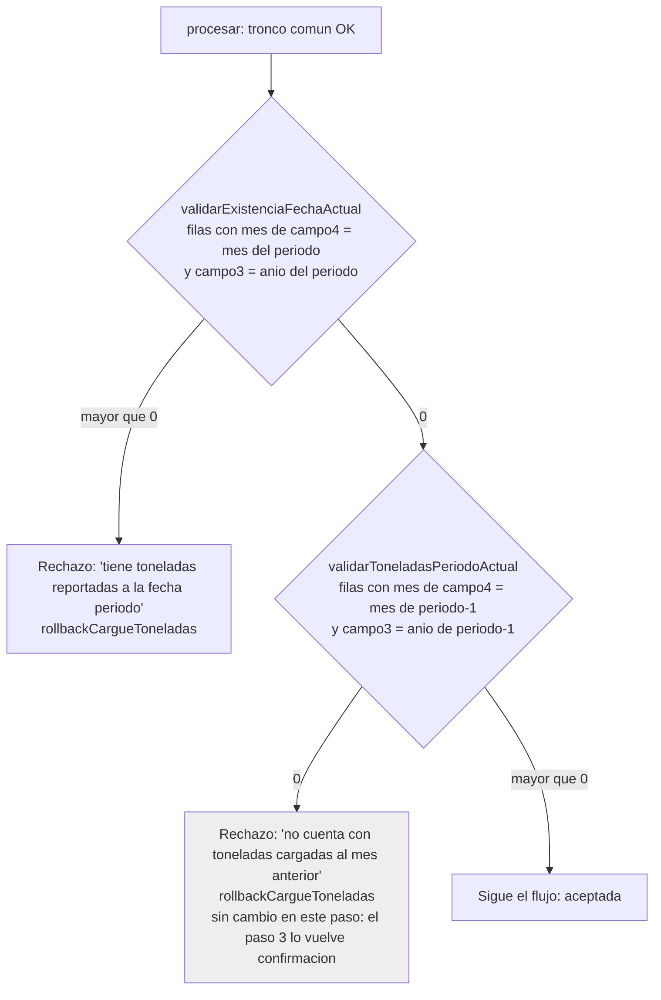

# Ticket 11180 — Paso 2: validaciones del mes sin depender del idioma

Repo: `status-full/status-api`. Lo ejecuta Fabian. Archivos:
`app/Http/Controllers/Sipa/CargarArchivos/CargarArchivosController.php` y
`tests/Feature/Modules/Aprovechamiento/CargarArchivos/ProcesarArchivoCsvTest.php`.

## Que compara cada metodo despues del cambio

| Metodo | Condicion del anio | Condicion del mes | Valor con `?` |
|---|---|---|---|
| `validarToneladasPeriodoActual` (L608) | `campo3` = anio de (periodo − 1 mes) | numero de mes de `campo4` = mes de (periodo − 1 mes) | `$request->periodo`, una vez por cada `?` |
| `validarExistenciaFechaActual` (L675) | `campo3` = anio del periodo | numero de mes de `campo4` = mes del periodo | `$request->periodo`, una vez por cada `?` |

Numero de mes de `campo4`: `EXTRACT(MONTH FROM TO_DATE(aprovechamiento.fn_convertmesaingles(campo4), 'Month'))`
(referencia: `database/DBobjects/function/2023122002_fn_validacion_prestador_semestre.sql:21`).

## Flujo de la carga de toneladas despues del paso 2 (la regla no cambia)

## Plan de construccion

**Paso 1 — Prueba nueva del mes del periodo (primero, para verla fallar).**
- Archivo: `ProcesarArchivoCsvTest.php`. Agregar `testRechazaToneladasDelMesPeriodo` despues de
  `testRechazaToneladasSinMesProcesado`.
- Contenido, en palabras: crear la liquidacion de `self::PERIODO`; procesar un archivo con el
  encabezado, una fila `filaToneladas(2030, 'FEBRERO')` y una fila `filaToneladas(2030, 'MARZO')`;
  esperar `success` false y el mensaje exacto
  `'El archivo de toneladas que esta cargando tiene toneladas reportadas a la fecha '.self::PERIODO`;
  esperar 0 filas en `dt_cargue_toneladas`.
- Verificar: `docker exec status-api-laravel.test-1 php artisan test --filter=testRechazaToneladasDelMesPeriodo`
  → **debe fallar** (en local sale el mensaje del "mes anterior", porque `MARZO` no es `MARCH`).

**Paso 2 — Quitar la omision por idioma.**
- Mismo archivo: borrar la llamada `$this->omitirSiMesesEnIngles();` (L82) y el metodo
  `omitirSiMesesEnIngles` con su docblock (L284-296).
- Verificar: `--filter=testAceptaToneladasDelMesProcesado` → **debe fallar** (rechazo por el idioma).

**Paso 3 — `validarToneladasPeriodoActual` (L608-623).**
- Borrar las lineas que calculan `$mes` y `$anioActual` en PHP (L610-616): el anio sale de SQL.
- La consulta queda: `DB::table('aprovechamiento.dt_cargue_toneladas')`, `->where('idliquidacion', $request->id)`,
  y un `whereRaw` con las dos condiciones de la tabla (anio y mes de periodo − 1 mes), con `?` y
  `[$request->periodo, $request->periodo]`. Para el `?` como fecha: `CAST(? AS date) - interval '1 month'`.
- Quitar `->select("*")` y cambiar `->get()->count()` por `->count()`: hoy trae todas las filas a
  PHP solo para contarlas.
- Docblock de maximo 3 renglones: que cuenta (filas del mes procesado, el anterior al periodo), con
  `@param Request $request` y `@return int`. Tipo de retorno `: int` en la firma.

**Paso 4 — `validarExistenciaFechaActual` (L675-683).**
- Igual que el paso 3, pero **sin** `- interval '1 month'`: mes y anio del periodo tal cual.
- Mismo cambio de `select("*")`/`get()->count()`, docblock y `: int`.

**Paso 5 — Verificacion.**
- `--filter=ProcesarArchivoCsvTest` → 7 pruebas en verde, ninguna omitida.
- Suite completa: `docker exec status-api-laravel.test-1 php artisan test` → todo en verde.
- Limpieza: 0 liquidaciones `2030%` en `status_testing` y 0 archivos en `/var/sftp/uploads`.
- `grep -n "TMMonth\|anioActual" app/Http/Controllers/Sipa/CargarArchivos/CargarArchivosController.php` → sin resultados.
- Revision de sobreingenieria y commit:
  `11180: validaciones del mes del cargue de toneladas sin depender del idioma del servidor`.
